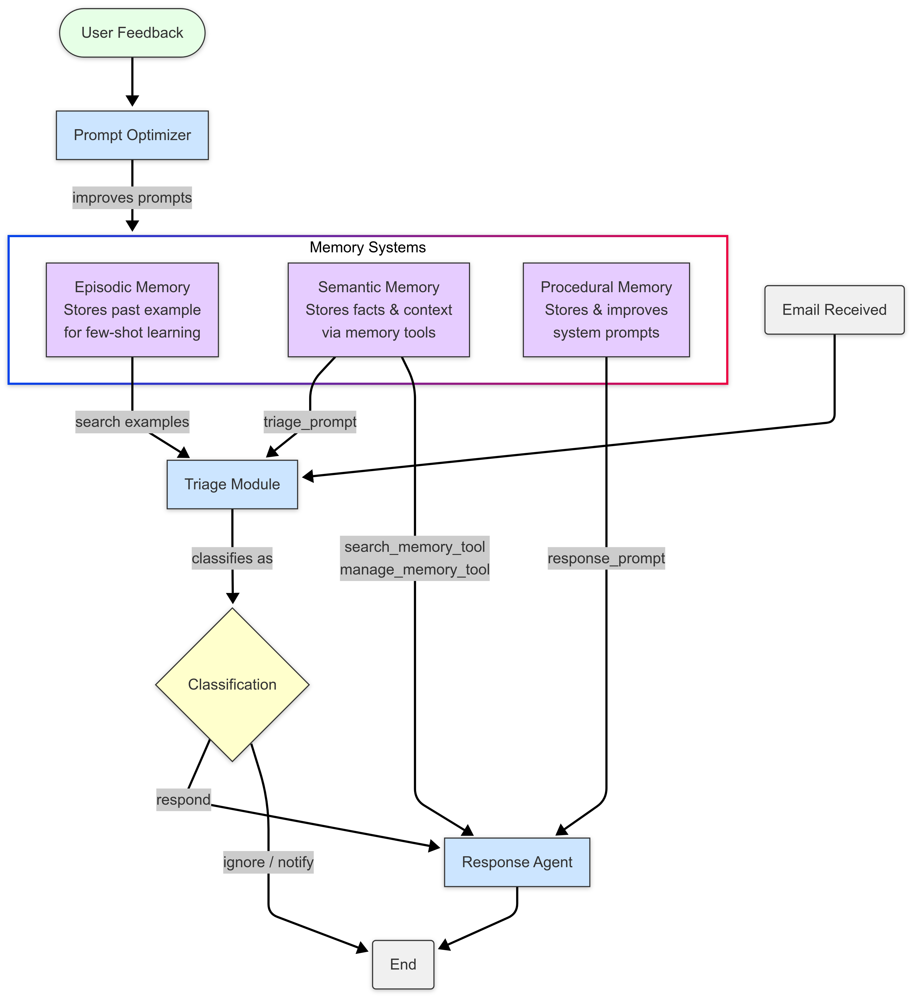

# Building Adaptive AI Agents with Long-Term Memory using LangGraph

Large Language Models (LLMs) have revolutionized AI, but their inherent statelessness—forgetting information between interactions—limits their ability to act as truly intelligent, personalized agents. Building agents that learn, adapt, and maintain context requires overcoming this limitation by implementing robust memory systems.

This article explores how to construct an AI agent, exemplified by an email assistant, endowed with persistent, long-term memory using LangGraph, LangChain, and specialized memory tools like LangMem. We'll delve into the practical implementation of three key memory types—Semantic, Episodic, and Procedural—demonstrating how they empower an agent to learn user preferences, recall past events, and refine its operational strategies over time.

## System Overview

The Email Assistant is an AI-powered agent built with LangGraph, LangChain, and Azure OpenAI. It demonstrates the implementation of advanced memory capabilities in intelligent agents, allowing the system to learn from interactions, remember facts, and adapt its behavior over time.



## Why Long-Term Memory Matters

Standard LLM applications often lack persistent memory, meaning they treat each interaction independently. This prevents them from:

1.  **Personalization:** Remembering user-specific facts, preferences, or context ("My colleague Sarah leads Project X").
2.  **Learning from Experience:** Recalling how similar tasks were successfully handled previously to improve future performance.
3.  **Adapting Behavior:** Modifying internal processes or rules based on feedback or outcomes.

Long-term agentic memory addresses these gaps, allowing agents to retain, recall, and utilize historical information to act more consistently, intelligently, and personally over extended periods.

## Example System: An Adaptive Email Assistant

Our focus will be on building an email assistant capable of:

* **Intelligent Triage:** Automatically classifying incoming emails (e.g., 'ignore', 'notify', 'respond') based on learned rules and past examples.
* **Contextual Response:** Drafting relevant replies using available tools and remembered facts.
* **Adaptive Learning:** Continuously improving its triage and response strategies using integrated memory systems.

## Architecture & Key Technologies

The assistant uses a modular architecture orchestrated by LangGraph.

**Core Components**:

1.  **Triage Module (Router):** The entry point; analyzes incoming emails using rules (Procedural Memory) and examples (Episodic Memory) to classify them.
2.  **Response Agent:** Handles emails needing replies, utilizing communication tools (like writing emails, checking calendars) and accessing/updating Semantic Memory. Often implemented using a ReAct (Reasoning and Action) pattern.
3.  **Memory Store:** A persistent storage system (e.g., a vector database like `InMemoryStore` for demonstration, or more robust options like PostgreSQL/pgvector in production) holding all three memory types.
4.  **LangGraph Workflow:** Defines the state transitions and control flow, managing interactions between modules and memory.
5.  **Prompt Optimizer:** Analyzes feedback and interaction history to refine system prompts stored in Procedural Memory.

**Key Technologies**:

* **LangGraph:** Essential for building stateful, potentially cyclic agent workflows. Manages state and allows conditional logic (branching, loops).
* **LangChain:** The foundational framework providing abstractions like tools (`@tool`), agent executors (`create_react_agent`), and LangChain Expression Language (LCEL).
* **LangMem:** Offers specialized tools for managing different memory types (e.g., `create_manage_memory_tool`, `create_search_memory_tool`, `create_multi_prompt_optimizer`).
* **LLM Provider (e.g., Azure OpenAI):** For core natural language understanding and generation tasks.
* **Pydantic:** For data validation and defining structured outputs.

## LangGraph for Stateful Orchestration

LangGraph provides the necessary framework for managing the state and complex control flow required for a memory-enabled agent. Unlike simpler chains, it supports cycles and conditional logic crucial for agentic behavior.

**How LangGraph is Used**:

1.  **State Definition:** A `TypedDict` defines the application's state, holding information like the input email and accumulating message history. This state persists across node executions.

    ```python
    # State definition using TypedDict
    from typing_extensions import TypedDict, Annotated
    from langgraph.graph.message import add_messages # Helper to append messages

    class State(TypedDict):
        email_input: dict # Holds details of the incoming email
        # Accumulates message history (human, ai, tool)
        messages: Annotated[list, add_messages]
        # Example: Add classification result to state
        # triage_classification: str | None = None
    ```
    *This defines the data structure passed between steps.*

2.  **Nodes:** Python functions or LCEL runnables representing processing units (e.g., `triage_router` node, `response_agent` node). Nodes receive the current state and return updates.

3.  **Edges:** Define connections between nodes. Conditional Edges allow dynamic routing based on the state (e.g., routing from triage to response agent or end based on classification).

    ```python
    # Graph Definition and Compilation Snippet
    from langgraph.graph import StateGraph, START, END
    from langgraph.store.memory import InMemoryStore # Example checkpointer

    # Assume store = InMemoryStore(...) is initialized
    email_agent_graph = StateGraph(State)

    # Add nodes (assuming triage_router_node and response_agent_runnable exist)
    email_agent_graph.add_node("triage_router", triage_router_node)
    email_agent_graph.add_node("response_agent", response_agent_runnable)

    # Define entry and conditional routing
    email_agent_graph.set_entry_point("triage_router")
    email_agent_graph.add_conditional_edges(
        "triage_router",
        lambda state: state.get("triage_classification", "error"), # Decision function
        {"respond": "response_agent", "ignore": END, "notify": END, "error": END} # Routing map
    )
    email_agent_graph.add_edge("response_agent", END)

    # Compile with persistence
    compiled_email_agent = email_agent_graph.compile(checkpointer=store)
    ```
    *Illustrates setting up the workflow with conditional routing and state persistence.*

4.  **Persistence (Checkpointer):** Compiling the graph with a checkpointer (like `InMemoryStore`) enables LangGraph to automatically save and load the agent's state, allowing interactions to persist across invocations.

## Implementing the Three Memory Types

### 1. Semantic Memory: The Agent's Fact Base

* **Purpose:** Stores and retrieves factual information, user preferences, and context-specific details. Prevents reliance solely on generic LLM knowledge.
* **Implementation:**
    * **Tools:** Use `create_manage_memory_tool` (to write/update facts) and `create_search_memory_tool` (to read/query facts) from LangMem, typically added to the response agent's toolset.
    * **Namespacing:** Crucial for multi-user environments. Use unique identifiers (e.g., `user_id`) within the memory namespace to isolate data (e.g., `("email_assistant", "{langgraph_user_id}", "collection")`).
    * **Storage & Retrieval:** Facts are often stored in a vector store. `search_memory_tool` uses semantic (vector similarity) search to find relevant facts based on meaning. This resembles Retrieval-Augmented Generation (RAG) but applied to a dynamic, interaction-specific knowledge base.

### 2. Episodic Memory: Learning from Experience

* **Purpose:** Stores records of specific past interactions or events, capturing *how* tasks were performed successfully. Enables few-shot learning by providing relevant examples.
* **Implementation:**
    * **Storage:** When a task (like email triage) is completed, store the interaction details (input email, reasoning, final classification) as an episode.
    * **Retrieval:** Before performing a similar task, retrieve relevant past episodes based on similarity to the current situation.
    * **Usage:** Include retrieved examples in the prompt for the LLM (few-shot prompting) to guide its current decision-making, adapting to user-specific patterns. Example format might include email details and the resulting triage decision.

### 3. Procedural Memory: Refining Skills and Rules

* **Purpose:** Stores and updates the agent's operational knowledge—how to perform tasks, follow procedures, or adhere to specific instructions or rules. Allows the agent to adapt its core behavior.
* **Implementation:**
    * **Storage:** System prompts, rules (e.g., triage rules), or instructions are stored persistently.
    * **Adaptation:** Use tools like LangMem's `create_multi_prompt_optimizer`. This component analyzes conversation history and user feedback (explicit or implicit) to suggest improvements to the stored prompts/rules.
    * **Mechanism:** Often handled asynchronously ("Subconscious Formation") to avoid adding latency to the main interaction loop. The optimizer generates refined prompts, which then update the procedural memory for future interactions.

## Best Practices

1.  **Memory Namespacing**: Always use appropriate namespacing (e.g., based on user ID) to separate data and ensure privacy, especially in multi-tenant systems.
2.  **Prompt Engineering**: Structure prompts clearly, often dividing them into sections like role definition, available tools, specific instructions, and memory context (like retrieved facts or examples).
3.  **Memory Type Selection**: Use the appropriate memory type for the task: Semantic for facts/preferences, Episodic for examples/history, and Procedural for rules/instructions.
4.  **Feedback Loop**: Implement clear mechanisms for collecting and incorporating user feedback (both explicit corrections and implicit signals) to drive Procedural memory adaptation.
5.  **Error Handling**: Add robust error handling around LLM calls and tool executions to make the agent more resilient.

## Limitations and Considerations

* **Scalability & Performance:** Memory retrieval from large stores can impact latency. Strategies like indexing optimization, memory pruning, or summarization might be necessary as the agent interacts more.
* **Data Privacy & Security:** Storing user interactions and preferences demands strict adherence to privacy regulations , strong data isolation between users, and secure storage practices.
* **Feedback Quality & Latency:** The effectiveness of procedural memory adaptation hinges on the quality and timeliness of feedback. Designing effective feedback mechanisms and managing the potential latency of asynchronous optimization loops are key design considerations.
* **Complexity**: Combining multiple memory types, tools, and conditional logic increases system complexity, requiring careful design and testing.
* **Model Dependency**: The ultimate quality of the agent's reasoning and responses still depends heavily on the capabilities of the underlying Large Language Model.

## Conclusion: Towards Truly Intelligent Agents

Equipping AI agents with long-term, multi-faceted memory using frameworks like LangGraph and specialized tools like LangMem marks a pivotal advancement. By moving beyond stateless limitations and enabling agents to learn facts (Semantic), improve from examples (Episodic), and refine their core behaviors (Procedural), we unlock the potential for significantly more capable, personalized, and adaptive AI assistants.

The email assistant serves as a concrete illustration, but the underlying principles—stateful orchestration (LangGraph), distinct memory functions (LangMem/Stores), and feedback-driven adaptation (Optimizers)—provide a robust foundation for building next-generation AI agents across diverse applications. Mastering these techniques is key for developers aiming to create systems that don't just respond, but learn, adapt, and truly assist in complex, long-running tasks.