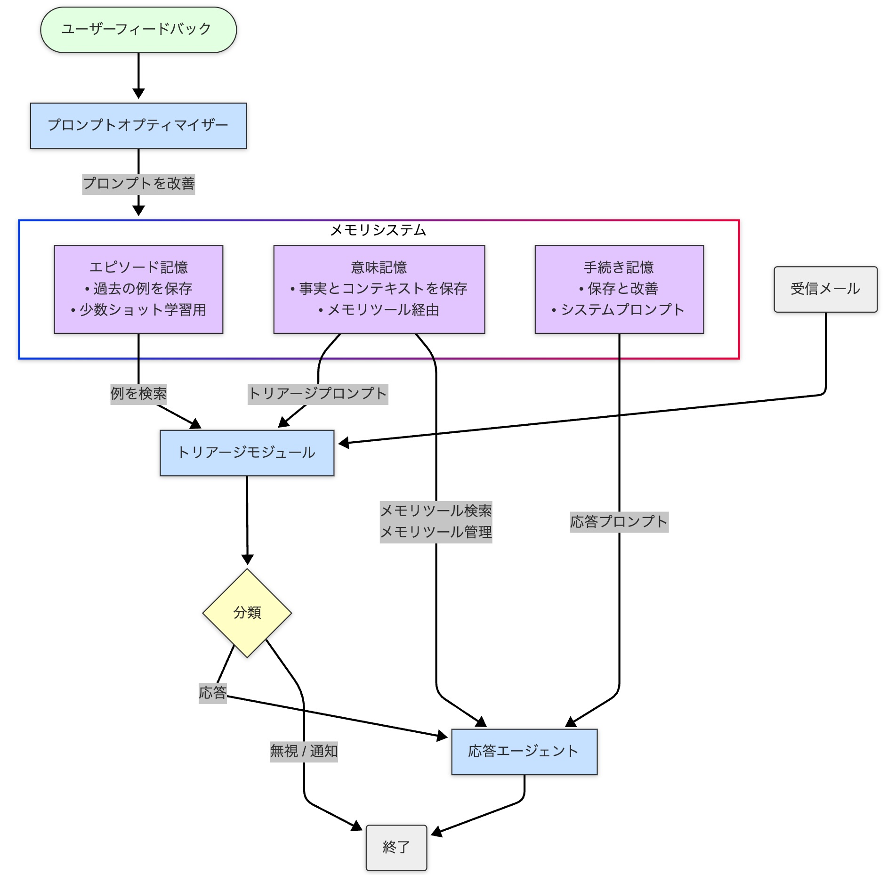

# LangGraph を使用して長期記憶を持つ適応型 AI エージェントを構築する

大規模言語モデル (LLM) は AI に革命をもたらしましたが、その固有のステートレス性 (インタラクション間で情報を忘れてしまうこと) は、真にインテリジェントでパーソナライズされたエージェントとして機能する能力を制限しています。エージェントが学習し、適応し、コンテキストを維持できるようにするには、堅牢なメモリシステムを実装することによってこの制限を克服する必要があります。

この記事では、LangGraph、LangChain、および LangMem のような特殊なメモリツールを使用して、永続的な長期記憶を備えたメールアシスタントを例に、AI エージェントを構築する方法を探ります。意味記憶、エピソード記憶、手続き記憶という 3 つの主要なメモリタイプの実際的な実装を掘り下げ、それらがどのようにエージェントがユーザーの好みを学習し、過去のイベントを思い出し、運用戦略を時間の経過とともに改良することを可能にするかを示します。

## システム概要

メールアシスタントは、LangGraph、LangChain、Azure OpenAI を使用して構築された AI 搭載エージェントです。インテリジェントエージェントにおける高度なメモリ機能の実装を示しており、システムがインタラクションから学習し、事実を記憶し、時間の経過とともにその動作を適応させることを可能にします。



## デモ

メールアシスタントが動作する様子の短いデモを、以下のリンクからYouTubeでご覧いただけます。

* [YouTubeでデモを視聴](https://youtu.be/8JT1aRQ5bbY)

https://youtu.be/8JT1aRQ5bbY


## 長期記憶が重要な理由

標準的な LLM アプリケーションには永続的なメモリがないことが多く、各インタラクションを独立して扱います。これにより、以下のようなことが妨げられます。

1.  **パーソナライズ:** ユーザー固有の事実、好み、またはコンテキストを記憶すること (「私の同僚のサラはプロジェクト X を率いています」)。
2.  **経験からの学習:** 類似のタスクが以前にどのように成功裏に処理されたかを思い出し、将来のパフォーマンスを向上させること。
3.  **行動の適応:** フィードバックや結果に基づいて内部プロセスやルールを変更すること。

長期的なエージェントメモリはこれらのギャップに対処し、エージェントが履歴情報を保持、想起、利用して、長期間にわたってより一貫性があり、インテリジェントで、個人的に行動できるようにします。

## 例: 適応型メールアシスタント

私たちの焦点は、以下を実行できるメールアシスタントの構築になります。

* **インテリジェントなトリアージ:** 学習したルールと過去の例に基づいて、受信メールを自動的に分類します (例: '無視'、'通知'、'返信')。
* **コンテキストに基づいた応答:** 利用可能なツールと記憶された事実を使用して、関連する返信を作成します。
* **適応学習:** 統合されたメモリシステムを使用して、トリアージと応答戦略を継続的に改善します。

## アーキテクチャと主要技術

アシスタントは、LangGraph によって調整されたモジュラーアーキテクチャを使用します。

**コアコンポーネント**:

1.  **トリアージモジュール (ルーター):** エントリポイント。ルール (手続き記憶) と例 (エピソード記憶) を使用して受信メールを分析し、分類します。
2.  **応答エージェント:** 返信が必要なメールを処理し、コミュニケーションツール (メール作成、カレンダー確認など) を利用し、意味記憶にアクセス/更新します。多くの場合、ReAct (Reasoning and Action) パターンを使用して実装されます。
3.  **メモリストア:** 3 つのメモリタイプすべてを保持する永続的なストレージシステム (例: デモンストレーション用の `InMemoryStore` のようなベクトルデータベース、または本番環境での PostgreSQL/pgvector のようなより堅牢なオプション)。
4.  **LangGraph ワークフロー:** モジュールとメモリ間のインタラクションを管理し、状態遷移と制御フローを定義します。
5.  **プロンプトオプティマイザー:** フィードバックとインタラクション履歴を分析し、手続き記憶に保存されているシステムプロンプトを改良します。

**主要技術**:

* **LangGraph:** ステートフルで、潜在的に循環的なエージェントワークフローを構築するために不可欠です。状態を管理し、条件付きロジック (分岐、ループ) を可能にします。
* **LangChain:** ツール (`@tool`)、エージェントエグゼキューター (`create_react_agent`)、LangChain Expression Language (LCEL) などの抽象化を提供する基盤フレームワークです。
* **LangMem:** さまざまなメモリタイプを管理するための特殊なツールを提供します (例: `create_manage_memory_tool`、`create_search_memory_tool`、`create_multi_prompt_optimizer`)。
* **LLM プロバイダー (例: Azure OpenAI):** コアとなる自然言語理解および生成タスク用。
* **Pydantic:** データ検証と構造化出力の定義用。

## ステートフルオーケストレーションのための LangGraph

LangGraph は、メモリ対応エージェントに必要な状態と複雑な制御フローを管理するためのフレームワークを提供します。単純なチェーンとは異なり、エージェントの動作に不可欠なサイクルと条件付きロジックをサポートします。

**LangGraph の使用方法**:

1.  **状態定義:** `TypedDict` は、入力メールや蓄積されたメッセージ履歴などの情報を保持するアプリケーションの状態を定義します。この状態は、ノードの実行全体で維持されます。

    ```python
    # TypedDict を使用した状態定義
    from typing_extensions import TypedDict, Annotated
    from langgraph.graph.message import add_messages # メッセージを追加するヘルパー

    class State(TypedDict):
        email_input: dict # 受信メールの詳細を保持
        # メッセージ履歴 (human, ai, tool) を蓄積
        messages: Annotated[list, add_messages]
        # 例: 状態に分類結果を追加
        # triage_classification: str | None = None
    ```
    *これはステップ間で渡されるデータ構造を定義します。*

2.  **ノード:** Python 関数または LCEL Runnable で、処理単位 (例: `triage_router` ノード、`response_agent` ノード) を表します。ノードは現在の状態を受け取り、更新を返します。

3.  **エッジ:** ノード間の接続を定義します。条件付きエッジは、状態に基づいて動的なルーティングを可能にします (例: 分類に基づいてトリアージから応答エージェントまたは終了へのルーティング)。

    ```python
    # グラフ定義とコンパイルのスニペット
    from langgraph.graph import StateGraph, START, END
    from langgraph.store.memory import InMemoryStore # チェックポインターの例

    # store = InMemoryStore(...) が初期化されていると仮定
    email_agent_graph = StateGraph(State)

    # ノードを追加 (triage_router_node と response_agent_runnable が存在すると仮定)
    email_agent_graph.add_node("triage_router", triage_router_node)
    email_agent_graph.add_node("response_agent", response_agent_runnable)

    # エントリポイントと条件付きルーティングを定義
    email_agent_graph.set_entry_point("triage_router")
    email_agent_graph.add_conditional_edges(
        "triage_router",
        lambda state: state.get("triage_classification", "error"), # 決定関数
        {"respond": "response_agent", "ignore": END, "notify": END, "error": END} # ルーティングマップ
    )
    email_agent_graph.add_edge("response_agent", END)

    # 永続性を持たせてコンパイル
    compiled_email_agent = email_agent_graph.compile(checkpointer=store)
    ```
    *条件付きルーティングと状態の永続性を使用してワークフローを設定する方法を示します。*

4.  **永続性 (Checkpointer):** チェックポインター (例: `InMemoryStore`) を使用してグラフをコンパイルすると、LangGraph はエージェントの状態を自動的に保存およびロードできるようになり、呼び出し間でインタラクションを永続化できます。

## 3つのメモリタイプの実装

### 1. 意味記憶: エージェントのファクトベース

* **目的:** 事実情報、ユーザーの好み、コンテキスト固有の詳細を保存および取得します。一般的な LLM 知識のみに依存することを防ぎます。
* **実装:**
    * **ツール:** LangMem の `create_manage_memory_tool` (事実の書き込み/更新用) と `create_search_memory_tool` (事実の読み取り/クエリ用) を使用し、通常は応答エージェントのツールセットに追加します。
    * **名前空間:** マルチユーザー環境では不可欠です。メモリ名前空間内で一意の識別子 (例: `user_id`) を使用してデータを分離します (例: `("email_assistant", "{langgraph_user_id}", "collection")`)。
    * **ストレージと取得:** 事実はしばしばベクトルストアに保存されます。`search_memory_tool` は、意味 (ベクトル類似性) 検索を使用して、意味に基づいて関連する事実を見つけます。これは、検索拡張生成 (RAG) に似ていますが、動的でインタラクション固有の知識ベースに適用されます。

### 2. エピソード記憶: 経験からの学習

* **目的:** 特定の過去のインタラクションやイベントの記録を保存し、タスクがどのように成功裏に実行されたかをキャプチャします。関連する例を提供することにより、少数ショット学習を可能にします。
* **実装:**
    * **ストレージ:** タスク (メールのトリアージなど) が完了すると、インタラクションの詳細 (入力メール、推論、最終分類) をエピソードとして保存します。
    * **取得:** 同様のタスクを実行する前に、現在の状況との類似性に基づいて関連する過去のエピソードを取得します。
    * **使用法:** LLM のプロンプトに取得した例を含める (少数ショットプロンプティング) ことで、現在の意思決定をガイドし、ユーザー固有のパターンに適応させます。例の形式には、メールの詳細と結果のトリアージ決定が含まれる場合があります。

### 3. 手続き記憶: スキルとルールの洗練

* **目的:** タスクの実行方法、手順の遵守、特定の指示やルールへの準拠など、エージェントの運用知識を保存および更新します。エージェントがコアとなる動作を適応させることを可能にします。
* **実装:**
    * **ストレージ:** システムプロンプト、ルール (例: トリアージルール)、または指示は永続的に保存されます。
    * **適応:** LangMem の `create_multi_prompt_optimizer` のようなツールを使用します。このコンポーネントは、会話履歴とユーザーフィードバック (明示的または暗黙的) を分析して、保存されているプロンプト/ルールの改善を提案します。
    * **メカニズム:** メインのインタラクションループにレイテンシを追加しないように、しばしば非同期 (「潜在意識形成」) で処理されます。オプティマイザーは洗練されたプロンプトを生成し、それが将来のインタラクションのために手続き記憶を更新します。

### GitHubリポジトリ

このメールアシスタントのソースコードは以下のGitHubリポジトリで公開されています。

https://github.com/givery-technology/ai-lab-email-assistant.git

## ベストプラクティス

1.  **メモリ名前空間**: 特にマルチテナントシステムでは、データを分離しプライバシーを確​​保するために、常に適切な名前空間 (例: ユーザー ID に基づく) を使用します。
2.  **プロンプトエンジニアリング**: 役割定義、利用可能なツール、特定の指示、メモリコンテキスト (取得した事実や例など) のようなセクションにしばしば分割して、プロンプトを明確に構造化します。
3.  **メモリタイプの選択**: さまざまな種類の情報に合わせて適切なメモリタイプを使用します: 事実/好みには意味記憶、例/履歴にはエピソード記憶、ルール/指示には手続き記憶。
4.  **フィードバックループ**: 手続き記憶の適応を促進するために、ユーザーフィードバック (明示的な修正と暗黙的なシグナルの両方) を収集および組み込むための明確なメカニズムを実装します。
5.  **エラー処理**: LLM 呼び出しとツール実行の周りに堅牢なエラー処理を追加して、エージェントの回復力を高めます。

## 制限事項と考慮事項

* **スケーラビリティとパフォーマンス:** 大規模なストアからのメモリ取得はレイテンシに影響を与える可能性があります。エージェントのインタラクションが増えるにつれて、インデックスの最適化、メモリのプルーニング、または要約などの戦略が必要になる場合があります。
* **データのプライバシーとセキュリティ:** ユーザーのインタラクションと設定を保存するには、プライバシー規制 の厳格な遵守、ユーザー間の強力なデータ分離、および安全なストレージ慣行が必要です。
* **フィードバックの質とレイテンシ:** 手続き記憶の適応の有効性は、フィードバックの質と適時性に依存します。効果的なフィードバックメカニズムの設計と、非同期最適化ループの潜在的なレイテンシの管理は、重要な設計上の考慮事項です。
* **複雑さ**: 複数のメモリタイプ、ツール、および条件付きロジックを組み合わせると、システムの複雑さが増し、慎重な設計とテストが必要になります。
* **モデルへの依存**: エージェントの推論と応答の最終的な品質は、依然として基盤となる大規模言語モデルの能力に大きく依存します。

## 結論: 真にインテリジェントなエージェントに向けて

LangGraph のようなフレームワークと LangMem のような特殊なツールを使用して、AI エージェントに長期的で多面的なメモリを装備することは、極めて重要な進歩を示しています。ステートレスな制限を超え、エージェントが事実を学習し (意味記憶)、例から改善し (エピソード記憶)、コアとなる動作を洗練させる (手続き記憶) ことを可能にすることで、大幅に能力が高く、パーソナライズされ、適応性のある AI アシスタントの可能性を解き放ちます。

メールアシスタントは具体的な例として役立ちますが、ステートフルオーケストレーション (LangGraph)、個別のメモリ機能 (LangMem/Stores)、およびフィードバック駆動型の適応 (Optimizers) という基盤となる原則は、多様なアプリケーションにわたる次世代 AI エージェントを構築するための堅牢な基盤を提供します。これらの技術を習得することは、単に応答するだけでなく、学習し、適応し、複雑で長期間にわたるタスクで真に支援するシステムを作成することを目指す開発者にとって重要です。

## 最後に
Givery AI Labが独自保有するフリーランス・副業の高単価AI案件や、随時開催しているセミナーやパーティなどのイベントにご興味ございましたら、ぜひTrack Worksのアカウント登録いただき、最新情報を受け取ってください！

https://job.tracks.run/track-works#top

「Track Works」とは？
Givery AI Labの運営会社である株式会社ギブリーが提供する、AI時代のフリーランスエンジニアとして「スキル」と「実績」を強化できる実践的なAI案件を、ご経歴やスキルに合わせてご紹介するフリーラナスエンジニア案件マッチングサービスです。Givery AI Labが独自保有するフリーランス・副業案件を紹介したり、AI技術やキャリアに関するイベントを随時開催しています。